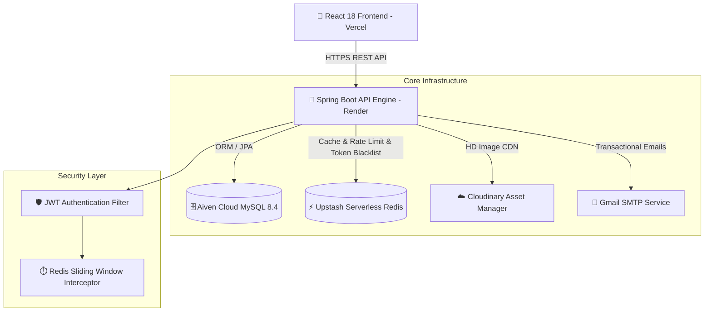

# 🛒 ShoppersClub — Production Backend REST API Engine


> **ShoppersClub Backend** is an enterprise-grade, high-throughput RESTful e-commerce API engine designed for seamless multi-vendor marketplaces. Powered by **Spring Boot 3.5**, **Java 21**, **Aiven Cloud MySQL**, **Upstash Serverless Redis**, **Cloudinary CDN**, and **Spring Security 6**.

---

## 🌟 Architecture & System Overview



---

## ✨ Key Enterprise Features

### 🛡️ 1. Security & Authentication
* **Stateless JWT Authentication**: Secure token-based authentication with expiration handling.
* **Instant Token Blacklisting**: Serverless Redis token blacklisting on `/logout` for instant session termination.
* **Role-Based Access Control (RBAC)**: Fine-grained permissions for `CUSTOMER`, `SELLER`, and `ADMIN`.

### ⚡ 2. Performance & Reliability
* **Sliding-Window Rate Limiting**: Custom Redis-backed `@RateLimit(limit, periodSeconds)` interceptor to prevent brute-force attacks.
* **HikariCP High-Throughput Connection Pool**: Optimized connection pooling for cloud-hosted MySQL.
* **Aiven Cloud Primary Key Compliance**: Full compatibility with `sql_require_primary_key=ON` database policy.

### 📦 3. E-Commerce Core Domain Logic
* **Multi-Vendor Marketplace**: Independent vendor stores, product management, and verified badge verification.
* **Strict Verified Buyer Reviews**: Only customers who purchased an item can leave reviews (prevents rating manipulation).
* **Automated Transactional Emails**: Instant SMTP triggers on account creation, order placement, and shipping updates.
* **Media Asset Pipeline**: Direct multi-part image uploads to Cloudinary CDN with automatic thumbnail transforms.

---

## 📡 API Endpoint Reference

### 🔐 Authentication (`/api/v1/auth`)
| Method | Endpoint | Access | Description |
| :--- | :--- | :--- | :--- |
| `POST` | `/api/v1/auth/register` | Public | Register a new customer account |
| `POST` | `/api/v1/auth/login` | Public | Authenticate user & issue JWT |
| `POST` | `/api/v1/auth/logout` | Authenticated | Blacklist active JWT in Redis |

### 🛍️ Products & Categories (`/api/v1/products`, `/api/v1/categories`)
| Method | Endpoint | Access | Description |
| :--- | :--- | :--- | :--- |
| `GET` | `/api/v1/categories` | Public | Fetch all active product categories |
| `GET` | `/api/v1/products` | Public | Paginated product catalog search & filter |
| `GET` | `/api/v1/products/{id}` | Public | Detailed product metadata with images & reviews |
| `POST` | `/api/v1/products` | Seller / Admin | Create a new product listing |

### 🛒 Cart & Orders (`/api/v1/cart`, `/api/v1/orders`)
| Method | Endpoint | Access | Description |
| :--- | :--- | :--- | :--- |
| `GET` | `/api/v1/cart` | Authenticated | Fetch active user cart items |
| `POST` | `/api/v1/cart/items` | Authenticated | Add item to cart |
| `POST` | `/api/v1/orders` | Authenticated | Place new order & trigger confirmation email |
| `GET` | `/api/v1/orders/my-orders` | Authenticated | Fetch user order history |

### 👑 Admin Management (`/api/v1/admin`)
| Method | Endpoint | Access | Description |
| :--- | :--- | :--- | :--- |
| `GET` | `/api/v1/admin/orders` | Admin | View all platform orders |
| `PUT` | `/api/v1/admin/orders/{id}/status` | Admin | Update shipping status & trigger notification |

---

## 🛠️ Environment Configuration

Set the following environment variables in production (Render) or local `.env`:

```env
# Spring Profile
SPRING_PROFILES_ACTIVE=prod

# Cloud Database (Aiven MySQL)
DB_URL=jdbc:mysql://<host>:<port>/defaultdb?useSSL=true&trustServerCertificate=true
DB_USERNAME=avnadmin
DB_PASSWORD=<aiven_password>
DB_DRIVER=com.mysql.cj.jdbc.Driver

# Serverless Redis (Upstash)
REDIS_HOST=<upstash_host>
REDIS_PORT=6379
REDIS_PASSWORD=<upstash_token>
REDIS_SSL=true

# JWT Security Secret (Min 32 characters)
JWT_SECRET=<32_char_secret_key>
JWT_EXPIRATION=86400000

# Cloudinary Assets CDN
CLOUDINARY_CLOUD_NAME=<cloud_name>
CLOUDINARY_API_KEY=<api_key>
CLOUDINARY_API_SECRET=<api_secret>
```

---

## 🚀 Local Development Setup

### 1. Prerequisites
* **Java 21 OpenJDK**
* **Maven 3.9+**
* **Docker Desktop** *(Optional)*

### 2. Clone & Build
```bash
git clone https://github.com/arish-704/ShoppersClub.git
cd ShoppersClub
mvn clean package -DskipTests
```

### 3. Run Locally (H2 Embedded Database)
```bash
mvn spring-boot:run
```
* **Local Server API**: `http://localhost:6969/api/v1`
* **H2 Console**: `http://localhost:6969/h2-console`

---

## 🐳 Docker Deployment

Build and run the production container locally:

```bash
# Build Docker image
docker build -t shoppersclub-backend .

# Run Docker container
docker run -p 10000:10000 --env-file .env shoppersclub-backend
```

---

## 🛡️ License

Distributed under the **MIT License**. See `LICENSE` for details.

Developed with ❤️ by **Arish Shahid**.
